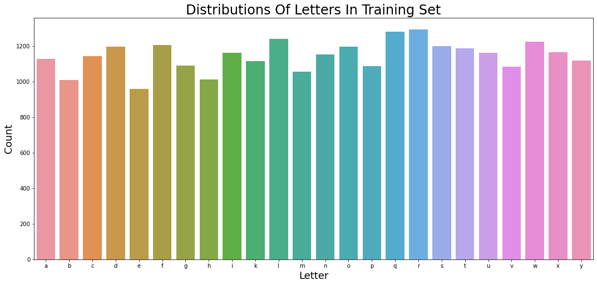
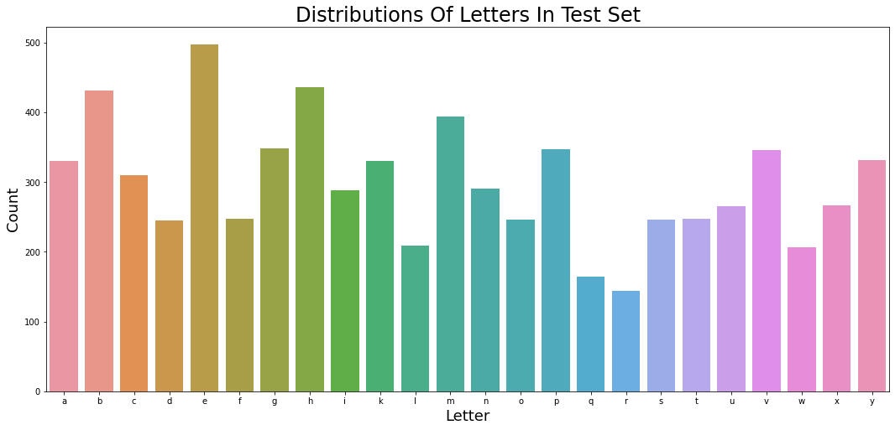
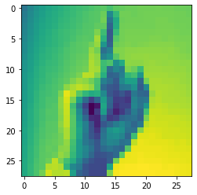
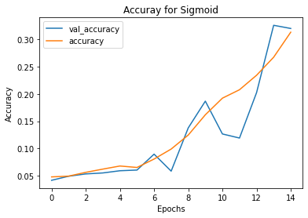
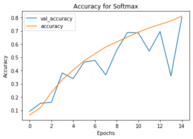
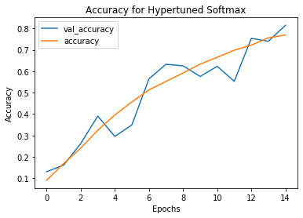

# Chocolate-lab

## Outline

- Dataset Introduction

- EDA

- Model

- CNN

- Insights

- Further exploration

## Project Goal

The goal for this project is to categorize giving American sign languages correctly to their matching English letters.

## Data Collection

The data was collected from Kaggle, originally uploaded by Kaggle account tecperson 2018. The data is composed by training csv with shape (27455, 785) and testing csv with shape (7172, 785). All are pixel values that gerenate 28x28 images.

## EDA

The graphic below shows distributions of letters in training set.

The graphic below shows distributions of letters in test set.

The graphic below is an example image transfered from training set csv.

## Data Prepping

- Create labels for both training set and testing set.

- Turn both training set and testing set into matrix(reshape), flatten, and standardize(devide by 255).

- Train validate split for training set.

- Set number of classes to 25 (26 letters - 2(no J,Z) +1(label))

- Trun train_label, validate_label into single row matrixes.

## MLP

### Sigmoid

- Test set accuracy: 0.29, Epochs = 15

### Softmax

- Test set accuracy: 0.59, Epochs = 15

### Hypertuned Softmax

- Test set accuracy: 0.63, Epochs = 15

